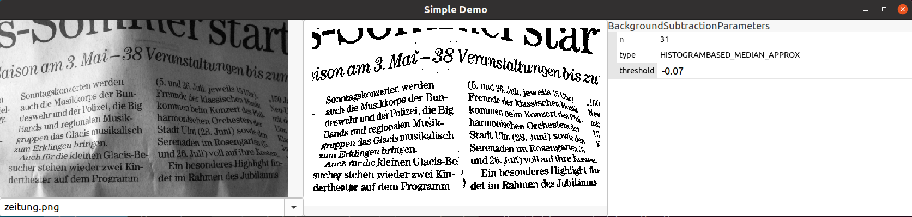

# MDSD demo toolchain and examples
[](https://github.com/goto40/mdsd/actions?query=workflow%3Arun-tests)

Here, we present a simple item and algorithmic
interface specification tool among other aspects.

 * Items = data structures (like C structs)
 * Algorithms = functions to transform items into other items.

## Example

Here, we model the data structures for
a simple algorithm of a GUI C++
application.

The **C++ Implementation is used in a C++ GUI Application**:


The **Reference Implementation (Python) is compared to the
C++ Implementation** (see "run_tests", then select the latest run and go to the "Artifacts"
[on the build server](https://github.com/goto40/mdsd/actions?query=workflow%3Arun-tests)).

Some items (`image.item` and `background_subtraction.item`)...
```
package my_image_lib

struct GrayImage {
  scalar w: built_in.uint32
  scalar h: built_in.uint32
  array pixel : built_in.float[h][w]
}
```
```
import "image.item"

package my_image_lib.background_subtraction

struct BackgroundSubtractionResults {
  scalar threshold: my_image_lib.GrayImage
  scalar result:    my_image_lib.GrayImage
}

enum MedianType : built_in.uint8 {
  value MEDIAN = 0
  value HISTOGRAMBASED_MEDIAN_APPROX = 1
}

struct BackgroundSubtractionParameters {
  scalar n: built_in.uint32 (.defaultValue=31)
  scalar type : MedianType (.defaultValue=HISTOGRAMBASED_MEDIAN_APPROX)
  scalar threshold: built_in.float (.defaultValue=-0.1)
}
```
...and the algorithm (background_subtraction.algo):
```
import "image.item"
import "background_subtraction.item"

package my_image_lib.background_subtraction

algo AlgoBackgroundSubtraction {
----------------------------------------
An algorithm to subtract the background
from an image. The background is approximated
by a median filtered version of the image.
----------------------------------------
    parameters {
        params: my_image_lib.background_subtraction.BackgroundSubtractionParameters
    }
    inputs {
        input: my_image_lib.GrayImage
    }
    outputs {
        output: my_image_lib.background_subtraction.BackgroundSubtractionResults
    }
}
```

## Purpose

Provide a simple MDSD chain as a **proof of concept**. Many aspects are experimental
and not meant to be used for production.

The goal is to **generate 100% code for item specifications** 
(input/output data and parameters for algorithms) and to
**provide a homogeneous algorithm skeleton**.

The idea is that the algorithm is implemented in a reference
language (e.g., in Python with numpy) and a target language. We
then provide means to run tests in order to compare these
implementations.

**Question**: Why do we generate 100% of the item code,
but not the algorithm code?
**Answer**: We think that algorithm development deserves much
creativity. This makes it important to have two independent
implementations (together with some documentation, e.g. as python
notebook). A single source for such an algorithm would
obscure how the algorithm works. This is part of the
documentation, provided manually.

The **item code is stereotypical**. Here, we take full advantage of a 
clear specification language and single source.

## Read more...

```
./activate_env
makdocs serve
```
(or look into the `docs` folder...)
