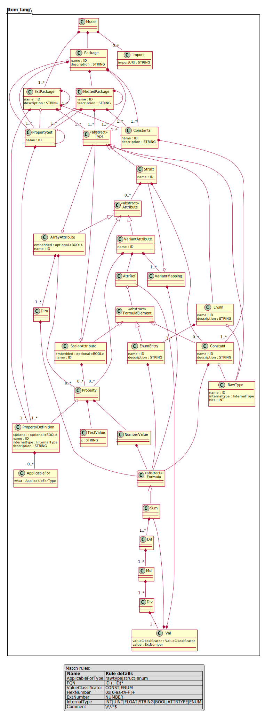

# Software Architecture

Here, we describe the rough architecture of the software

## Language

 * `item_lang` is a [textx](https://github.com/textX/textX) language.
 * `item_lang/__init__.py` defines the language (compare also `setup.py`).
 * A fixed base model is included (see `item_lang/__init__.py`)
   to define some basic types (like `built_in.uint32`).
 
## Grammar

 * The grammar is located in `item_lang/item_lang.tx`.

### Structure

 * The model consists of objects of the following types
   * `Struct` (like C-structs), with data members (`Attribute`).
      Each `Attribute` can have properties (`Property`) to 
      add meta information (like `minValue`, `maxValue`,
      `defaultValue`, ...).
   * `Enum` (like C-enums)
   * `Constant` (integer or floating point constant values, either
      located in a separate `Constant` section or within a `Struct`).

 * Properties of attributes represent an optional aspect of the model.
   * Without properties, the model represents mainly structural information
     (e.g., a point with x/y attributes).
   * With properties, additional information can be included in the
     generated code (like min/max values, e.g., a point with x/y values
     which must be positive).
   * You can define additional user defiend properties to your model.
     For most languages, these additional properties (maybe formatting hints
     or additional value restrictions) are included in the generate
     code (without chaging the cod egenerator itself).
   

## Meta model classes

 * Metamodel classes are located in `item_lang/metamodel_classes.py`
   and `item_lang/metamodel_formula.py`.
 * All metamodel classes are made available by `item_lang.metamodel_classes.get_all_classes()`.

## Model Validation

 * All validation procedures are located in `item_lang/validation.py`.
 * All validation functions in the validation module must start with `check_` followed by
   the class name of the model element to be checked (e.g. `check_Attribute`).
 * All validation functions are included automatically by the metamodel (based on the function name).

## Code Generators

 * Generators are shipped separate python projects.
 * They make use of the core `item_lang` language and tools.
 * Common concept of "enhanced reflection", which fits into a visitor pattern.
 * Note: for the moment you find the generators embedded in this project...
 
## Model Tools

 * `item_lang.common`: common helper functions to access model data.
 * `item_lang.properties`: common helper functions to access model data (focused on property data).
